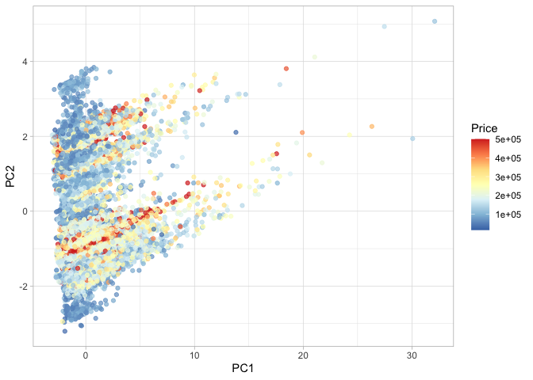
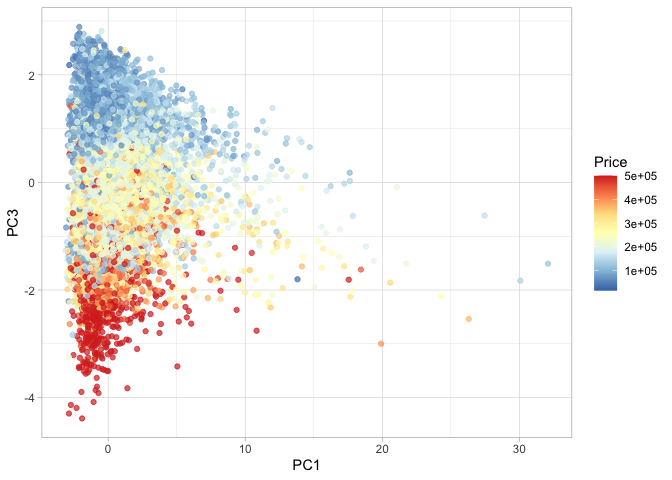
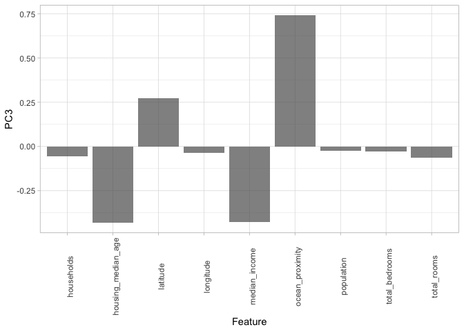

# Using PCA with the California Housing Dataset

# Objective

The aim is to apply Principal Component Analysis (PCA) to [the
California Housing
dataset](https://github.com/ahmedmoustafa/datasets/tree/main/housing),
with the goal of exploring structures and reducing dimensionality. This
analysis is to identify the principal components that best capture the
variability in the housing data, which can provide insights into the
most influential factors affecting housing values across California.

# Starting up

So let’s first make sure that the required packages are installed. If
they are not already installed, they will be installed.

``` r
if (!require("ggplot2")) install.packages("ggplot2")
```

    Loading required package: ggplot2

``` r
library(ggplot2)
theme_set(theme_light()) # Set the default ggplot theme to the light theme
```

# Loading the dataset

``` r
df1 = read.csv ("https://raw.githubusercontent.com/ahmedmoustafa/datasets/main/housing/housing.csv")
dim(df1)
```

    [1] 20640    10

``` r
head(df1)
```

| longitude | latitude | housing_median_age | total_rooms | total_bedrooms | population | households | median_income | median_house_value | ocean_proximity |
|----------:|---------:|-------------------:|------------:|---------------:|-----------:|-----------:|--------------:|-------------------:|:----------------|
|   -122.23 |    37.88 |                 41 |         880 |            129 |        322 |        126 |        8.3252 |             452600 | NEAR BAY        |
|   -122.22 |    37.86 |                 21 |        7099 |           1106 |       2401 |       1138 |        8.3014 |             358500 | NEAR BAY        |
|   -122.24 |    37.85 |                 52 |        1467 |            190 |        496 |        177 |        7.2574 |             352100 | NEAR BAY        |
|   -122.25 |    37.85 |                 52 |        1274 |            235 |        558 |        219 |        5.6431 |             341300 | NEAR BAY        |
|   -122.25 |    37.85 |                 52 |        1627 |            280 |        565 |        259 |        3.8462 |             342200 | NEAR BAY        |
|   -122.25 |    37.85 |                 52 |         919 |            213 |        413 |        193 |        4.0368 |             269700 | NEAR BAY        |

# Cleaning the dataset

To ensure the quality of our analysis, it is essential to address
missing values within our dataset. So, we implement a user-defined
function named `is_any_na()`. This function will detect the presence of
missing values in each row of the dataset. Identifying rows with missing
data is a crucial **preprocessing** step, as incomplete information can
significantly skew PCA results and lead to inaccurate interpretations.

``` r
is_any_na = function (x) {
  return (any(is.na(x)))
}
```

We will now utilize our user-defined function `is_any_na()` to
systematically **apply** across the dataset, identifying which rows
contain missing values.

``` r
missing = apply(df1, 1, is_any_na)
head(missing)
```

    [1] FALSE FALSE FALSE FALSE FALSE FALSE

The vector `missing` is a list of Boolean values, where `TRUE` entries
correspond to rows in `df1` that contain at least one missing (i.e.,
`NA`) entry.

**Note**: If we pass a list of Boolean values to the `sum()` function,
it will return the **number** of `TRUE` values. So the number of rows in
`df1` with missing values:

``` r
sum(missing)
```

    [1] 207

An overview of the rows with missing values

``` r
head(df1[missing, ])
```

|     | longitude | latitude | housing_median_age | total_rooms | total_bedrooms | population | households | median_income | median_house_value | ocean_proximity |
|:----|----------:|---------:|-------------------:|------------:|---------------:|-----------:|-----------:|--------------:|-------------------:|:----------------|
| 291 |   -122.16 |    37.77 |                 47 |        1256 |             NA |        570 |        218 |        4.3750 |             161900 | NEAR BAY        |
| 342 |   -122.17 |    37.75 |                 38 |         992 |             NA |        732 |        259 |        1.6196 |              85100 | NEAR BAY        |
| 539 |   -122.28 |    37.78 |                 29 |        5154 |             NA |       3741 |       1273 |        2.5762 |             173400 | NEAR BAY        |
| 564 |   -122.24 |    37.75 |                 45 |         891 |             NA |        384 |        146 |        4.9489 |             247100 | NEAR BAY        |
| 697 |   -122.10 |    37.69 |                 41 |         746 |             NA |        387 |        161 |        3.9063 |             178400 | NEAR BAY        |
| 739 |   -122.14 |    37.67 |                 37 |        3342 |             NA |       1635 |        557 |        4.7933 |             186900 | NEAR BAY        |

Now let’s extract the rows without any missingness by, basically,
negating (with the `!` operator) the `missing` vector i.e., switching
`TRUE` to `FALSE` and switching `FALSE` to `TRUE`:

``` r
df2 = df1[!missing, ]
dim(df2)
```

    [1] 20433    10

Dataframe `df2` has 20433 without any missing value ✓

It is almost ready for performing the PCA analysis; however, the input
matrix to the `procomp()` function must be **numeric** and our dataset
contains a categorical a variable/column/feature `ocean_proximity` with
the following values:

``` r
table(df2$ocean_proximity)
```

| \<1H OCEAN | INLAND | ISLAND | NEAR BAY | NEAR OCEAN |
|-----------:|-------:|-------:|---------:|-----------:|
|       9034 |   6496 |      5 |     2270 |       2628 |

To be able to proceed with the PCA analysis, we must to convert
`ocean_proximity` to `numeric` but first we need to convert to `factor`
with the appropriate `levels` the convert the `factor` to `numeric`:

``` r
df2$ocean_proximity = as.numeric(factor(df2$ocean_proximity, 
                                        levels = c("ISLAND", # The closest to the ocean
                                                   "NEAR BAY", 
                                                   "NEAR OCEAN", 
                                                   "<1H OCEAN", 
                                                   "INLAND" # The farthest from the ocean
                                                   )
                                        )
                                 )
head(df2)
```

| longitude | latitude | housing_median_age | total_rooms | total_bedrooms | population | households | median_income | median_house_value | ocean_proximity |
|----------:|---------:|-------------------:|------------:|---------------:|-----------:|-----------:|--------------:|-------------------:|----------------:|
|   -122.23 |    37.88 |                 41 |         880 |            129 |        322 |        126 |        8.3252 |             452600 |               2 |
|   -122.22 |    37.86 |                 21 |        7099 |           1106 |       2401 |       1138 |        8.3014 |             358500 |               2 |
|   -122.24 |    37.85 |                 52 |        1467 |            190 |        496 |        177 |        7.2574 |             352100 |               2 |
|   -122.25 |    37.85 |                 52 |        1274 |            235 |        558 |        219 |        5.6431 |             341300 |               2 |
|   -122.25 |    37.85 |                 52 |        1627 |            280 |        565 |        259 |        3.8462 |             342200 |               2 |
|   -122.25 |    37.85 |                 52 |         919 |            213 |        413 |        193 |        4.0368 |             269700 |               2 |

Notice the converted `numeric` values under the `ocean_proximity`
column.

# Calculating the PCA

Since the `median_house_value` column is the target variable in the
dataset, it should not be part of the input matrix to the `prcomp()`
function to perform the PCA analysis. Therefore, we will exclude it by
referencing its column number (column \#9) with the negative sign.

``` r
pca_result = prcomp(df2[, -9], scale. = TRUE)
summary(pca_result)
```

    Importance of components:
                              PC1    PC2    PC3    PC4     PC5     PC6     PC7
    Standard deviation     1.9778 1.3968 1.1163 1.0322 0.75136 0.38516 0.25365
    Proportion of Variance 0.4346 0.2168 0.1385 0.1184 0.06273 0.01648 0.00715
    Cumulative Proportion  0.4346 0.6514 0.7899 0.9083 0.97100 0.98748 0.99463
                               PC8     PC9
    Standard deviation     0.18325 0.12138
    Proportion of Variance 0.00373 0.00164
    Cumulative Proportion  0.99836 1.00000

The above PCA summary shows that PC1 explains about 43.5% of the total
variance in the dataset, followed by PC2 which explains about 21.7%,
then PC3 which explains about 13.8%. And the first three PCs (PC1, PC2,
and PC3) together (cumulatively) explain about 79% of the total variance
in the dataset.

# Visualizing the PCA

In this section, our goal is to explore whether there’s any inherent
structure, clustering, or grouping in the transformed dataset, as
represented by the projections (or scores) of the housing data onto the
principal components (PCs). A key step in this exploration is overlaying
the original features, particularly the target variable
`median_house_value`, onto the transformed PCA space. This approach
provides a visual representation of how the target variable relates to
the principal components. To achieve this, we will construct an
augmented dataframe that combines the principal components with the
feature of interest, `median_house_value`.

``` r
pca_df = data.frame(Price = df2$median_house_value, pca_result$x)
head(pca_df)
```

|  Price |       PC1 |      PC2 |       PC3 |        PC4 |        PC5 |        PC6 |        PC7 |       PC8 |        PC9 |
|-------:|----------:|---------:|----------:|-----------:|-----------:|-----------:|-----------:|----------:|-----------:|
| 452600 | -2.185099 | 1.916306 | -2.472818 |  1.5576456 | -0.1891739 |  0.1032005 | -0.1096529 | 0.3203179 |  0.0806733 |
| 358500 |  2.839508 | 2.470729 | -2.221468 |  1.7377453 |  0.2792764 | -0.4302054 |  0.1230018 | 0.1383711 | -0.2798972 |
| 352100 | -2.063872 | 2.014337 | -2.644023 |  0.6088575 | -0.6418161 |  0.0165362 |  0.0919113 | 0.2401319 |  0.0548983 |
| 341300 | -2.011551 | 2.024811 | -2.286231 | -0.1151974 | -0.3273401 | -0.0131452 |  0.0728109 | 0.2043440 |  0.0420453 |
| 342200 | -1.867736 | 2.050271 | -1.901657 | -0.8910065 | -0.0088765 | -0.1675948 |  0.2513776 | 0.0948725 | -0.0155539 |
| 269700 | -2.245589 | 1.994377 | -1.906964 | -0.7757001 |  0.0163533 | -0.0897660 |  0.1179234 | 0.1472960 |  0.0249755 |

## PC1 & PC2

Now, let’s create a scatter plot to visualize the distribution of houses
based on their projections onto the first two principal components, PC1
and PC2. In this plot, each house will be represented by a point, with
the position determined by its scores on these principal components. To
gain more insights, we will color-code these points based on the
`median_house_value`

``` r
ggplot(pca_df) +
  geom_point(aes(x = PC1, y = PC2, color = Price), alpha = 0.7) +
  scale_color_distiller(palette = "RdYlBu")
```



## PC1 & PC3

Now that we have visualized and analyzed the distribution of house
prices along PC1 and PC2, let’s proceed to explore another dimension. We
will create a similar scatter plot, this time projecting the houses onto
PC1 and PC3.

``` r
ggplot(pca_df) +
  geom_point(aes(x = PC1, y = PC3, color = Price), alpha = 0.7) +
  scale_color_distiller(palette = "RdYlBu")
```



In above visualization, we can observe a distribution where higher house
prices (darker red points) are primarily concentrated at the lower end
of PC3 while spread out along PC1. This suggests that PC3 captures
aspects of the data that inversely relate to house prices, with lower
scores on PC3 potentially associated with higher house values.

# Loadings onto the Principal Components

To understand the influence of the original variables on the principal
components, we will examine the loadings, which reflect how each
variable contributes to, or weighs upon, each principal component. Our
focus is particularly on PC3, as our visual analysis suggested it has a
significant relationship with house prices. By analyzing the loadings
for PC3, we can find out which features most strongly drive this
component and, by extension, may have a more direct impact on the
housing values in the dataset.

``` r
pca_result$rotation
```

|                    |        PC1 |        PC2 |        PC3 |        PC4 |        PC5 |        PC6 |        PC7 |        PC8 |        PC9 |
|:-------------------|-----------:|-----------:|-----------:|-----------:|-----------:|-----------:|-----------:|-----------:|-----------:|
| longitude          |  0.0805186 | -0.6982497 | -0.0361321 | -0.0502090 | -0.0049693 | -0.0954444 |  0.2012927 |  0.6669366 | -0.0876365 |
| latitude           | -0.0748256 |  0.6630434 |  0.2740786 |  0.0602034 | -0.1052334 | -0.0442013 |  0.1655640 |  0.6560906 | -0.0716720 |
| housing_median_age | -0.2216216 |  0.0662264 | -0.4296288 | -0.5286401 | -0.6933133 | -0.0325366 |  0.0188148 |  0.0182212 |  0.0053527 |
| total_rooms        |  0.4829436 |  0.0838299 | -0.0623221 |  0.0757857 | -0.1387150 | -0.3133721 |  0.7376618 | -0.2565323 | -0.1507077 |
| total_bedrooms     |  0.4894560 |  0.0706398 | -0.0275453 | -0.1275389 | -0.0167275 | -0.3794877 | -0.2936749 |  0.1300465 |  0.7006926 |
| population         |  0.4712478 |  0.0345713 | -0.0256393 | -0.1270844 | -0.0687266 |  0.8500818 |  0.0996878 |  0.0764219 |  0.1295458 |
| households         |  0.4904366 |  0.0769056 | -0.0549193 | -0.1267378 | -0.0297202 | -0.1406062 | -0.5062419 |  0.0526256 | -0.6743702 |
| median_income      |  0.0430112 |  0.0041074 | -0.4264794 |  0.8037141 | -0.3659183 |  0.0569105 | -0.1512771 |  0.0929070 |  0.0405064 |
| ocean_proximity    |  0.0393394 | -0.2220157 |  0.7408060 |  0.1192285 | -0.5909259 |  0.0041157 | -0.1105564 | -0.1563529 |  0.0165306 |

``` r
loadings = data.frame (Feature = row.names(pca_result$rotation), pca_result$rotation)
loadings
```

|                    | Feature            |        PC1 |        PC2 |        PC3 |        PC4 |        PC5 |        PC6 |        PC7 |        PC8 |        PC9 |
|:-------------------|:-------------------|-----------:|-----------:|-----------:|-----------:|-----------:|-----------:|-----------:|-----------:|-----------:|
| longitude          | longitude          |  0.0805186 | -0.6982497 | -0.0361321 | -0.0502090 | -0.0049693 | -0.0954444 |  0.2012927 |  0.6669366 | -0.0876365 |
| latitude           | latitude           | -0.0748256 |  0.6630434 |  0.2740786 |  0.0602034 | -0.1052334 | -0.0442013 |  0.1655640 |  0.6560906 | -0.0716720 |
| housing_median_age | housing_median_age | -0.2216216 |  0.0662264 | -0.4296288 | -0.5286401 | -0.6933133 | -0.0325366 |  0.0188148 |  0.0182212 |  0.0053527 |
| total_rooms        | total_rooms        |  0.4829436 |  0.0838299 | -0.0623221 |  0.0757857 | -0.1387150 | -0.3133721 |  0.7376618 | -0.2565323 | -0.1507077 |
| total_bedrooms     | total_bedrooms     |  0.4894560 |  0.0706398 | -0.0275453 | -0.1275389 | -0.0167275 | -0.3794877 | -0.2936749 |  0.1300465 |  0.7006926 |
| population         | population         |  0.4712478 |  0.0345713 | -0.0256393 | -0.1270844 | -0.0687266 |  0.8500818 |  0.0996878 |  0.0764219 |  0.1295458 |
| households         | households         |  0.4904366 |  0.0769056 | -0.0549193 | -0.1267378 | -0.0297202 | -0.1406062 | -0.5062419 |  0.0526256 | -0.6743702 |
| median_income      | median_income      |  0.0430112 |  0.0041074 | -0.4264794 |  0.8037141 | -0.3659183 |  0.0569105 | -0.1512771 |  0.0929070 |  0.0405064 |
| ocean_proximity    | ocean_proximity    |  0.0393394 | -0.2220157 |  0.7408060 |  0.1192285 | -0.5909259 |  0.0041157 | -0.1105564 | -0.1563529 |  0.0165306 |

``` r
ggplot(loadings) +
  geom_bar(aes(x = Feature, y = PC3), stat = "identity", alpha = 0.7) +
  theme(axis.text.x = element_text(angle = 90))
```



We can see from the above plot, `ocean_proximity` holds the most
positive loading among the features, suggests that `ocean_proximity` has
a strong positive correlation with PC3, pointing to a significant impact
of ocean proximity on the housing values as captured by this principal
component. On the other hand, `housing_median_age` shows a substantial
negative loading which means that areas with older houses tend to have
lower scores on PC3, possibly reflecting housing market dynamics related
to the age of properties.
